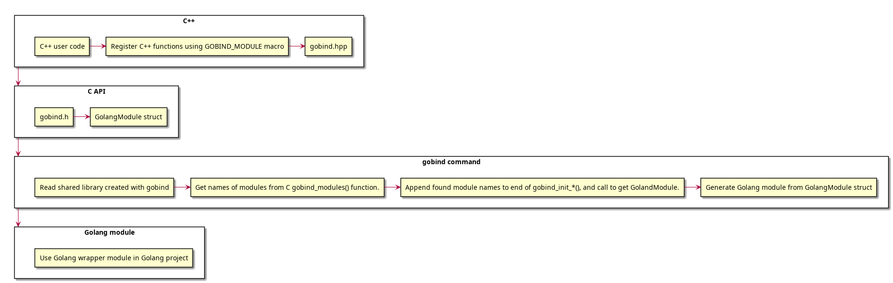

Gobind
======
C++ library for exposing C++ functions to Golang.

## Build
Build using the following:
```shell
cmake -S . -B build/ -DGOBIND_EXAMPLES=TRUE
cmake --build build/ --parallel 4
```

Then install a helper CLI program for interpreting shared libraries generated using `gobind`:
```shell
go install github.com/soerlemans/gobind@latest
```

## Usage
First you need to compile a 
```cpp
// STL Includes:
#include <iostream>

// Library Includes:
#include <gobind/gobind.hpp>

auto hello_world() -> void
{
  std::cout << "Hello World!\n";
}

// Define  the simple module for the add function.
GOBIND_MODULE(hello_world, m)
{
  m.def("HelloWorld", &hello_world);
}
```

```go
```

Add documentation for the `go generate` to do before we generate the module definition.
Using Gobind cli.

## Development
So how does the inner workings of the library work?
So the library has the following process:


### Step 1: C++
First in your C++ project you define a module by including `gobind.hpp`.
And then using the `GOBIND_MODULE()` macro to create bindings for functions that you want to expose to Golang.
Then you need to compile your C++ code into a shared library.

### Step 2: C
Golang cannot import C++ functions directly.
So we need a compatibility layer.
Golang can interface with C code via cgo.
So what we do is store function pointers to all exported functions inside a C struct.
Called `GolangModule` which is defined in `gobind.h`.

### Step 3: Gobind cli
Then in order to call the C++ functions seamlessly we have the `gobind` cli tool.
Which opens the shared library containing your C++ code.
Obtains any `GolangModule` struct's.
And based on this generates a Golang module with wrapper functions that call function pointers.
Inside the `GolangModule`.

### Step 4: Gobind module
Once this module is generated just include like regular.
Then call C++ code directly.
